# Kantin Otomasyon Projesi
### Frontend kısmı React tabanlı Next JS kullanılarak *[create-next-app](https://github.com/vercel/next.js/tree/canary/packages/create-next-app)* komutuyla oluşturulmuştur.
- Xampp kullanılarak localhost üzerinden veritabanı işlemlerini yapmaktadır.
- API (backend) tarafı Laravel 10 kullanılarak yazılmıştır.
- Proje barkod okuyucusu ile ve manuel olarak çalışmaktadır.
- Gelen ürünü girme,
- Gelen ürüne ait birden fazla stok girme,
- Her stoğun ayrı ayrı fiyatlandırmasını girme,
- Satış yaparken ilk giren ilk çıkar mantığı kullanması,
- Ürünlerin o anki durumunun Excel ve PDF olarak döküm alınması,
- İlk gelen stok bittiğinde diğer stoğa manuel veya otomatik olarak geçip o stoğun fiyatından satışı desteklemesi,
gibi daha bir çok özelliği desteklemektedir.

## Projeye ait görüntüler:

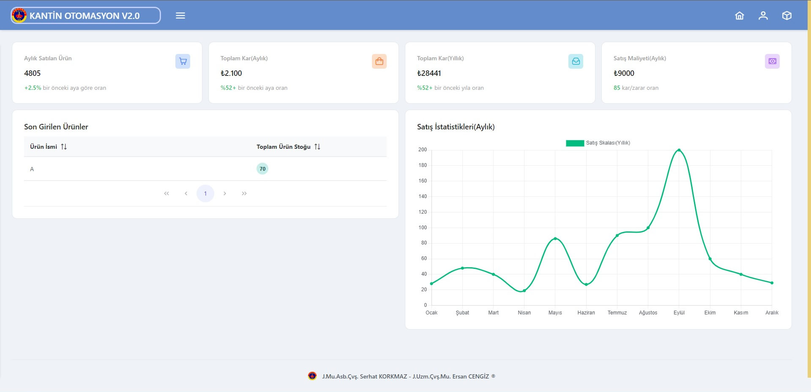
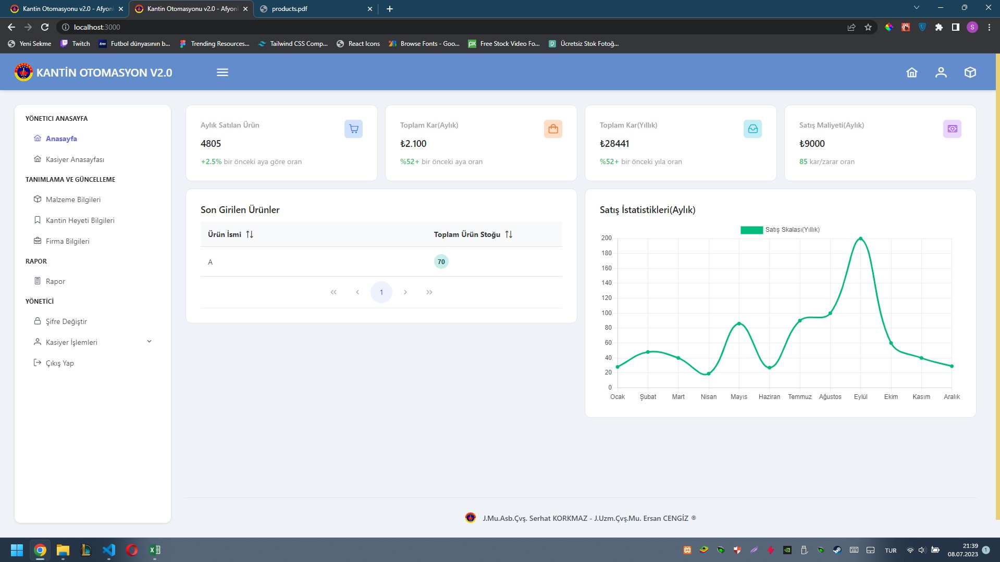
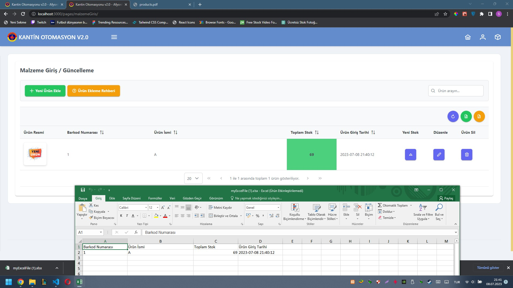
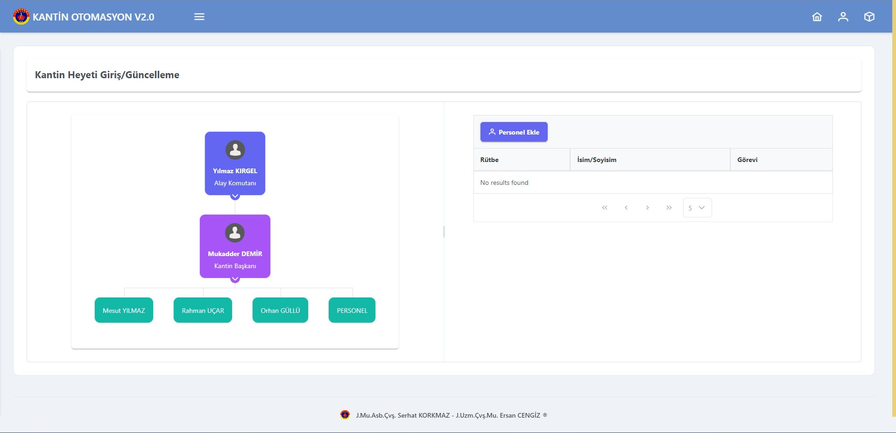

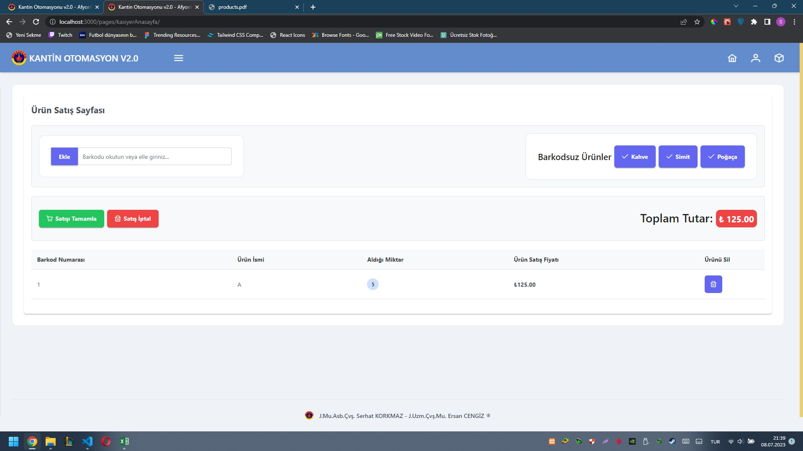
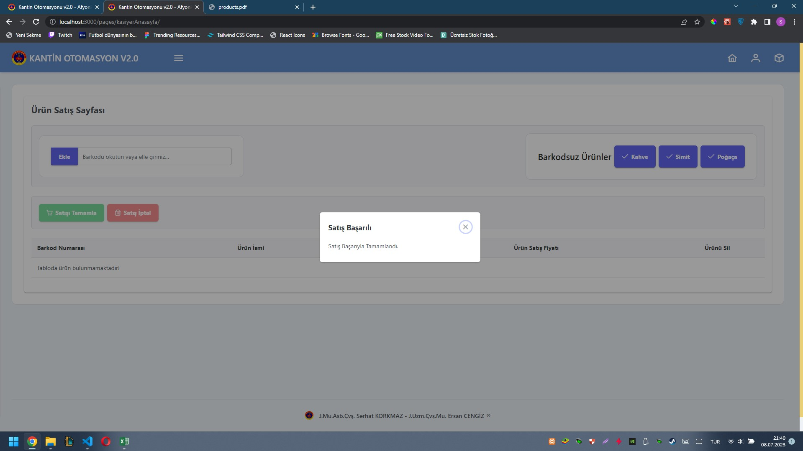
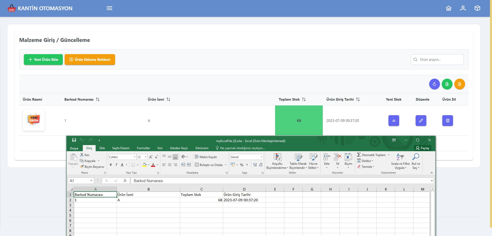
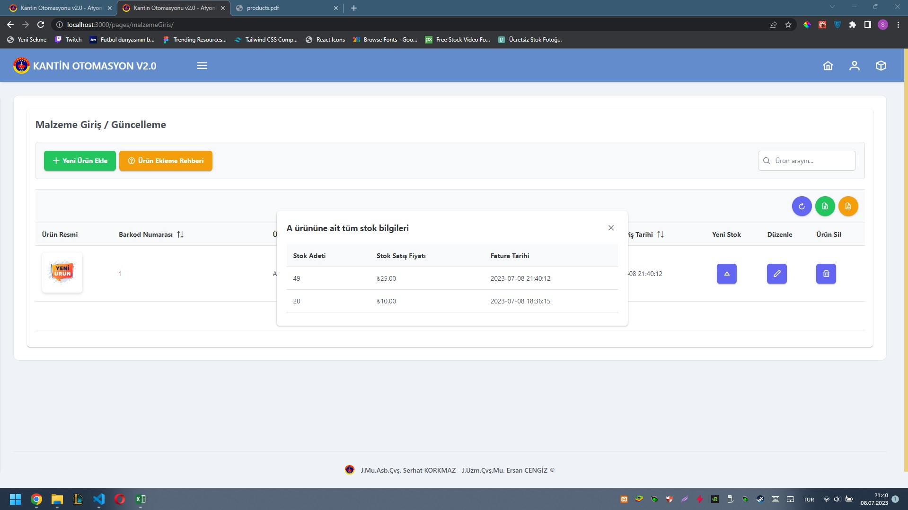
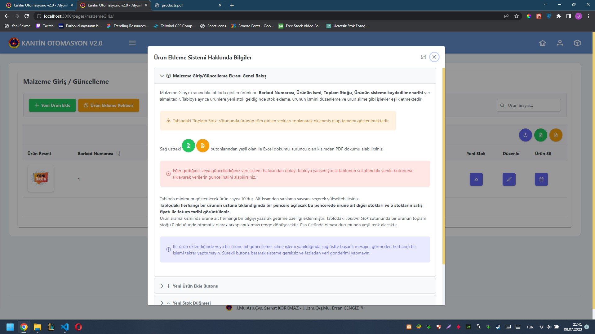
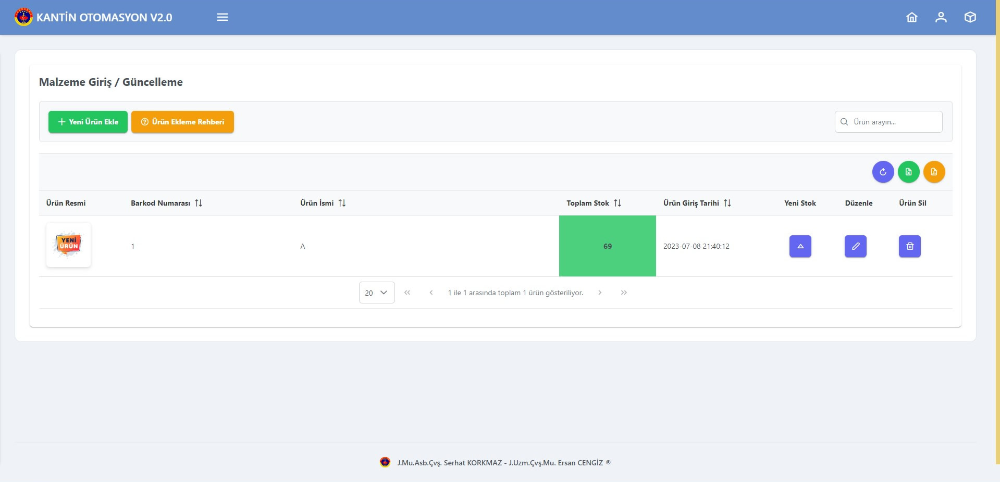
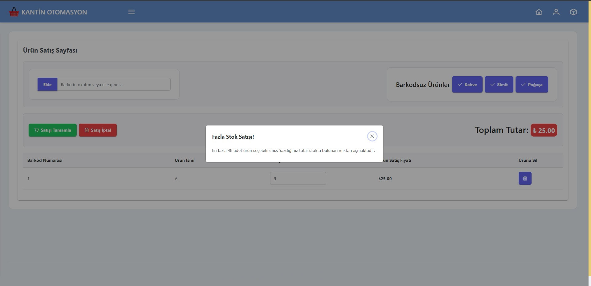